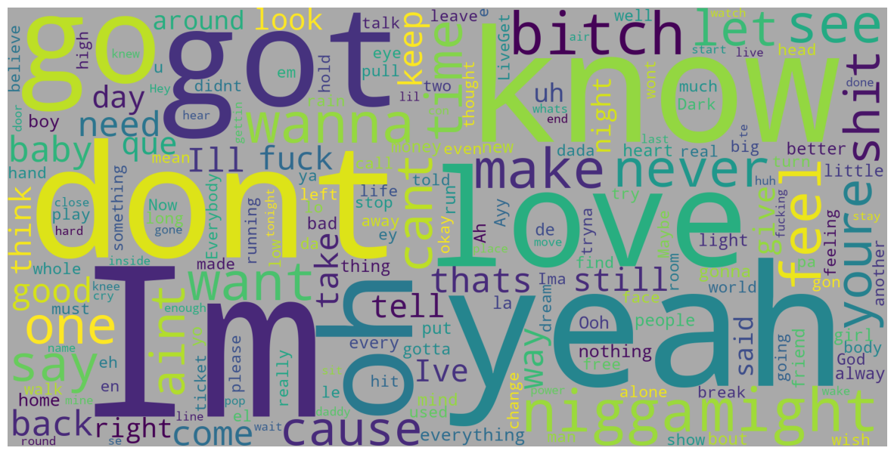
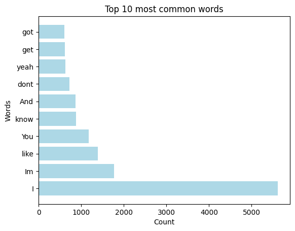
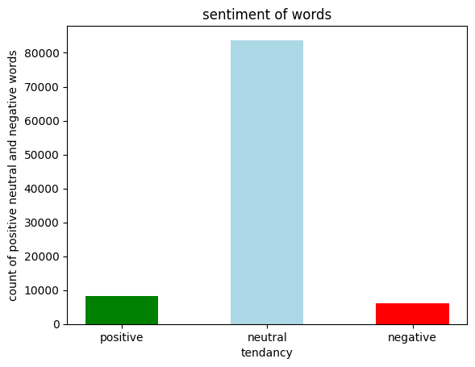
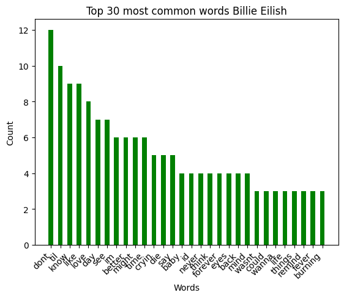
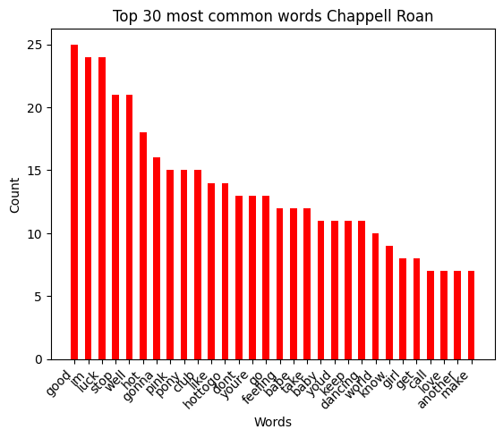
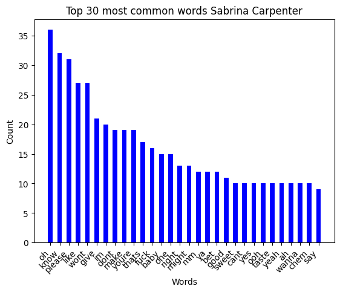

SER594: Exploratory Data Munging and Visualization
Title: Analyzing music lyrics and their sentiments 
Author: Hitesh Kolluru
Date: October, 22nd
## Basic Questions
**Dataset Author:**  Hitesh Kolluru

**Dataset Construction Date:** Novermber 23rd, 2023

**Dataset Record Count:** 
437 songs in total we have about 500 songs
but I have filtered out songs that are not in english as 
I am currently not processing them, I have included songs that have some 
partial use of other languages

**Dataset Field Meanings:** 
artist,song_id,title,url,lyrics,year,Lyrics_Processed,Sentiment of lyrics,compound_sentiment,negative,neutral,positive,compound,Languages,word_count,word_count_unique,lyrical_density,happy,love,sadness,anger,foul,total_words,unique_words,syllables,lines,unique_word_density,syllable_density,line_density

It has the name of the artist and the song id and the followed by the lyrics and after processing I add a few more attributes one for processed lyrics and then for sentiment of lyrics
compound_sentiment,negative,neutral,positive - discuss the sentiment of the song
happy,love,sadness,anger,foul -  checked each song and if the song had words that would indicate 
either then tagged them as happy,love,sadness,anger,foul

the remaining features are for identifying lyrical density
total_words,unique_words,syllables,lines,unique_word_density,
syllable_density,line_density

each of them can be an indicator of simple or poetic songs

**Dataset File Hash(es):** not applicable as the dataset was
created by me

## Interpretable Records
### Record 1

RAW Data

Chappell Roan,10090037,"Good Luck, Babe!",https://genius.com/Chappell-roan-good-luck-babe-lyrics,"101 ContributorsTranslationsBahasa IndonesiaPortuguêsDeutschEspañolFrançaisTürkçeHebrewItalianoDanskCatalàTiếng ViệtPolskiGood Luck, Babe! Lyrics
It's fine, it's cool
You can say that we are nothing, but you know the truth
And guess I'm the fool
With her arms out like an angel through the car sunroof

I don't wanna call it off
But you don't wanna call it love
You only wanna be the one that I call ""baby""

You can kiss a hundred boys in bars
Shoot another shot, try to stop the feeling
You can say it's just the way you are
Make a new excuse, another stupid reason
Good luck, babe (Well, good luck)
Well, good luck, babe (Well, good luck)
You'd have to stop the world just to stop the feeling
Good luck, babe (Well, good luck)
Well, good luck, babe (Well, good luck)
You'd have to stop the world just to stop the feeling

I'm cliché, who cares?
It's a sexually explicit kind of love affair
And I cry, it's not fair
I just need a little lovin', I just need a little air
You might also like
Think I'm gonna call it off
Even if you call it love
I just wanna love someone who calls me ""baby""

You can kiss a hundred boys in bars
Shoot another shot, try to stop the feeling
You can say it's just the way you are
Make a new excuse, another stupid reason
Good luck, babe (Well, good luck)
Well, good luck, babe (Well, good luck)
You'd have to stop the world just to stop the feeling
Good luck, babe (Well, good luck)
Well, good luck, babe (Well, good luck)
You'd have to stop the world just to stop the feeling

When you wake up next to him in the middle of the night
With your head in your hands, you're nothing more than his wife
And when you think about me all of those years ago
You're standing face to face with ""I told you so""
You know I hate to say it, I told you so
You know I hate to say, but I told you so

You can kiss a hundred boys in bars
Shoot another shot, try to stop the feeling (Well, I told you so)
You can say it's just the way you are
Make a new excuse, another stupid reason
Good luck, babe (Well, good luck)
Well, good luck, babe (Well, good luck)
You'd have to stop the world just to stop the feeling
Good luck, babe (Well, good luck)
Well, good luck, babe (Well, good luck)
You'd have to stop the world just to stop the feeling
You'd have to stop the world just to stop the feeling
You'd have to stop the world just to stop the feeling
You'd have to stop the world just to stop the feeling12Embed"

Interpretation: 
It has the name of the artist and the song id, url and the followed by the lyrics and after processing I add a few more attributes one for processed lyrics and then for sentiment of lyrics

### Record 2
Raw Data: 

Rod Wave,10972409,25,https://genius.com/Rod-wave-25-lyrics,"21 Contributors25 Lyrics
Uh, uh-uh, uh, uh
Oh, do you do this often?
I know it sound wrong, like, everything I left in Maryland
I just don't wanna see myself anymore, I don't
They, like, they say they miss me and shit, shut up, for real, like, man
Look, 'kay

DJ, run it back, play my song in this bitch
Vibin' like I'm alone in this bitch, mm
Tit for tat, I got you back, was I wrong for that shit?
Tell me, is we too grown for that shit? Uh
I wanna lock it in, baby, no weighin' my options
Wanna travel, see the world, gettin' drunk on an island
Wanna settle, start a family, so tell me about it
And you so perfect, baby, don't give nobody that body (Okay)
Social anxiety, I fear
And I done been this way for some years
I don't really get along with my peers
Everything that they do to me is weird
So in a world full of weirdos, fools, and scrubs
Tell me, what is it you're willin' to do for love?
You know it's true that the datin' pool is fucked
Ain't nobody out here, baby, it just be us
And I know, and I know, and I know, and I know a broken heart when I see one
And I feel, and I feel, and I feel, and I feel like I love you more
Did you know? Do you know? Did you know? Do you know I'm a shoulder if you need one?
When I feel what I feel, keep it real, what’s the deal? I'm ready for
Oh, somewhere we could be alone, you and me alone
I remember bein' twenty-one when my life had just begun
Twenty-two, many things to see and do
Twenty-three, lookin' forward to twenty-four
Is it just me or it ain't no love no more?
Twenty-five, what a time to be alive
Am I getting old? Why do I feel tired?
All the same old things, the same old games
Same old pain, think it's time for a change 'cause
Certain shit ain't like me no more
Certain shit don't excite me no more
It don't excite no more, no
It ain't like me no more
No more, no more
No, no, no, no, no
Certain shit don't excite me no more
It ain't like me no more
This ain't like me no more, no
It don't excite me no more, uh
See Rod Wave LiveGet tickets as low as $80You might also like
UhEmbed"

Interpretation: 
It has the name of the artist and the song id, url and the followed by the lyrics and after processing I add a few more attributes one for processed lyrics and then for sentiment of lyrics

## Background Domain Knowledge

Through reading about lyric analysis, I learned that it's 
not just about technical features like word count or syllable
density, but also about understanding the emotional and 
thematic elements within the lyrics. In particular, 
I discovered that by identifying specific words associated 
with emotions like happiness or sadness, I could classify 
songs based on their emotional tone. This approach allowed 
me to explore how the emotional content of lyrics might 
influence a song's popularity, providing valuable insights 
into the broader patterns in contemporary music and the 
connection between lyrical themes and listener engagement.

From reading about the use of lyric analysis in therapy, 
I learned that analyzing song lyrics can be a powerful tool 
for facilitating meaningful conversations, especially with 
adolescents. I discovered that music is often an extension 
of who teens are and how they see themselves, making it a 
valuable resource for discussing complex topics like death, 
loss, grief, and emotions. This approach encourages a 
natural and comfortable way for adolescents to express 
their feelings. Additionally, I learned the importance of 
using client-preferred songs, and the value of asking 
open-ended questions that allow teens to explore their 
own emotional responses to the music. The process of 
actively listening to lyrics, identifying key phrases, 
and relating them to personal experiences can deepen the 
connection between the client and therapist, fostering 
understanding and self-reflection.

Further exploring the other sources on the impact of lyrics, 
I learned that songs utilize a wide range of word choices 
and meanings to convey emotions and messages. 

Songs that are particularly catchy often feature repetitive 
words and phrases, which can help engage the listener by 
creating familiarity and rhythm. This repetition can enhance 
the song's memorability and emotional impact, drawing the 
audience into the music more effectively.

Songs that are lyrically dense tend to feature more complex
and intricate word choices, often conveying deeper meanings 
and nuanced emotions. These songs may include layered 
metaphors, intricate storytelling, and diverse vocabulary 
that invites listeners to interpret the lyrics in multiple ways. 
While they might require more attention and reflection to 
fully appreciate, lyrically dense songs can offer a richer, 
more thought-provoking listening experience. They often 
resonate with listeners who enjoy unpacking the layers of 
meaning within the lyrics, offering a more profound connection 
to the music.

## Dataset Generality
[//]: # (I was getting my data from billboards but I faced 
problems when wanting to increase the scope from this week 
to the previous weeks or years so I have switched to 
the pitchforks website)
My dataset is dynamically, sourced from the Pitchfork's website, 
which provides the accurate information of most popular songs of the 
current year and the past 4 years. This data reflects the most 
relevant trends in music. By fetching additional song 
details from the Genius API, I am able to enrich the dataset
with comprehensive information, such as song titles, 
artists, and lyrics, allowing for an in-depth analysis of 
the current music scene.

## Data Transformations
I get raw lyrics from genius and the text has irrelevant text at the start and at the end of the lyrics and those need to be removed 
so I split the string and keep the necessary section and discard the rest, then I remove punctuations, stop words and clean the text further

### Transformation N
Description: removal of stop words, punctuations
Soundness Justification: I have only removed text data that won't be relevant like punctuation so we can focus on 
more meaningful words, reduce noise and improve accuracy when visualising this data.
Description: Added sentiment 
Soundness Justification: wanted to process sentiment of lyrics to get an understand on what the general sentiment of the lyrics was.

## Visualizations
created a visualization of the most common words by the 3 most popular artists and then also by the general data.
show the most used words by artist and their count in their lyrics.
created a sentiment analysis of the general words that are used. it shows an overwhelming majority for neutral words as expected and few positive and negative words
created a wordcloud to show the most popular words. it show how often a word is used and and give an understanding of the frequency.

### Visual 1
Visualizing the words used in the lyrics I have obtained

### Visual 2
Visualizing the sentiment of each of the words 
to see what is the general sentiment of words used.

### Visual Artist  
Will not be able to generate presently 
as I have switched from billboard to pitchfork, and I have commented the code.

### Visual N
Analysis:
The scatter plot created using PCA (Principal Component 
Analysis) on song lyrics provides valuable insights into the 
patterns and relationships between songs based on their 
lyrical content. By reducing the high-dimensional TF-IDF 
(Term Frequency-Inverse Document Frequency) matrix to two 
dimensions (PC1 and PC2), we are able to visualize the most 
significant variations in word usage across songs. 
The X-axis (PC1) captures the primary source of variation, 
which could represent dominant themes or styles in the
lyrics, such as sentiment or the use of certain vocabulary. 
The Y-axis (PC2) captures the secondary sources of variation , 
which may reflect other lyrical features like complexity or 
specific topics (e.g., love, party, or social issues). 
Songs that are close to each other on the scatter plot share 
similar lyrical content, while songs that are farther apart 
have more distinct word usage patterns. 
Additionally, coloring the points by year helps identify 
trends over time, revealing how lyrical themes or language 
have evolved across different years. This plot can uncover 
underlying trends in popular music, such as shifts in 
sentiment, thematic focus, or language style, providing 
a visual representation of how songs group together or
differ based on their lyrics.

