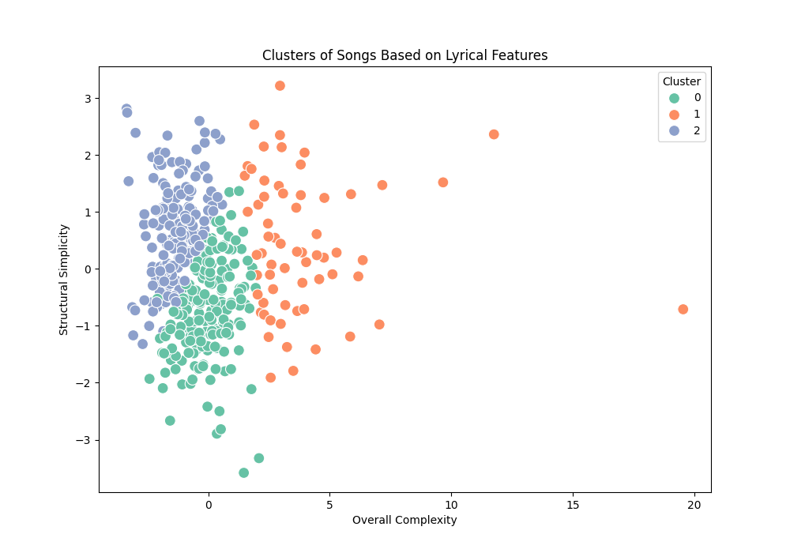
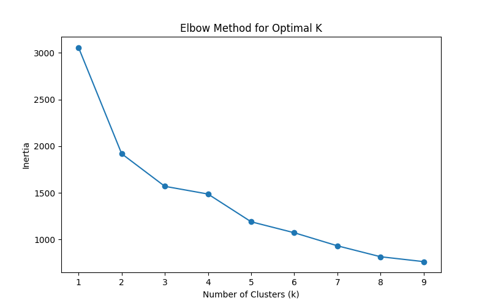

#### SER594: Machine Learning Evaluation
#### Title: Lyric Insights: Analyzing Sentiment and Clustering Song Patterns Using Machine Learning
#### Author: Hitesh Kolluru
#### Date: November 25th, 2024

## Evaluation Metrics
identifying song sentiment happy and sad. 

Then I am identifying the complexity of the songs lyrics based on things like lyrical density (unique_words/words)
lines 

### Metric 1
Accuracy:The percentage of total predictions that were correct. Best used when classes in the dataset are balanced.
Precision: Out of all the positive predictions, the percentage that was actually correct. Important when false positives are costly
Recall: The percentage of actual positives correctly identified by the model. Critical when missing positive cases (false negatives) is costly.
F1 Score: The harmonic mean of precision and recall, balancing both metrics. Useful when there’s an imbalance between classes.
Mean Squared Error (MSE): The average squared difference between predicted and actual values. A lower value indicates more accurate predictions in regression tasks.

### Metric 2
Silhouette Score: Evaluate cluster separation
Inertia: Measure compactness of clusters (specific to K-Means)
Davies-Bouldin Index: Measure average similarity ratio.

## Alternative Models
### Alternative 1
[linear_regression_model.pkl](models/linear_regression_model.pkl)

**Construction:** 
used vectorized song lyrics and compounded sentiment to identify sentiment in songs

**Evaluation:** 
Accuracy: 0.73
Precision: 0.76
Recall: 0.86
F1 Score: 0.81
Mean Squared Error (MSE): 0.1777

### Alternative 2
[linear_regression_Word2Vec_model.pkl](models/linear_regression_Word2Vec_model.pkl)
**Construction:**
used vectorized song lyrics and compounded sentiment to identify sentiment in songs
applied smote to increase sample in data to manage underfitting.

**Evaluation:** 
Accuracy: 0.53
Precision: 0.64
Recall: 0.66
F1 Score: 0.65
Mean Squared Error (MSE): 37692.4330

### Alternative 3

[linear_regression_happy_model.pkl](models/linear_regression_happy_model.pkl)

**Construction:** 
Used happy words associated within song lyrics to identify and tag songs as happy songs
used this to then compare with song lyrics and then predict if the song is a happy song

**Evaluation:** 
Accuracy: 0.80
Precision: 0.83
Recall: 0.91
F1 Score: 0.87
Mean Squared Error (MSE): 0.1663

### Alternative 4

[linear_regression_sad_model.pkl](models/linear_regression_sad_model.pkl)

**Construction:**
Used happy words associated within song lyrics to identify and tag songs as sad songs
used this to then compare with song lyrics and then predict if the song is a sad song

**Evaluation:** 
Accuracy: 0.61
Precision: 0.61
Recall: 0.74
F1 Score: 0.67
Mean Squared Error (MSE): 0.2513

### Alternative 5
[kmeans_model.pkl](models/kmeans_model.pkl)
**Construction**
Used lyrical features like 
wordcount, unique wordcount, lyrical density, use of syllables, lines, 
syllable_density, line density.

**Evaluation**
Silhouette Score: 0.32908829138793266 (Evaluate cluster separation)
Inertia: 1570.6779395674891 (Measure compactness of clusters (specific to K-Means))
Davies-Bouldin Index: 0.8368970371382543 (Measure average similarity ratio.)
and then finally visualized the clusters formed

## Visualization
### Visual N
**Analysis:** The Kmeans models the clusters it was able to identify.

the use of the elbow method to identify the most optimal K

## Best Model

**Model:** My Kmeans model [kmeans_model.pkl](models/kmeans_model.pkl)

My best model is the kmeans model that identifies how 
complex a song is based on the lyrical density of the song through various factor 
like wordcount, unique wordcount, lyrical density, use of syllables, lines, 
syllable_density, line density.
There is much room for improvement as I believe we can generate more 
clusters that are also more defined with a larger dataset

